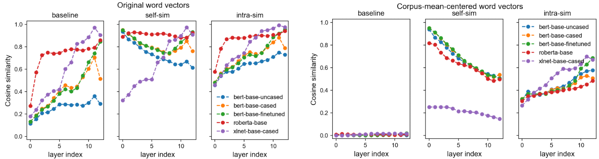

# Improving Text Generation Evaluation with Batch Centering and Tempered Word Mover Distance
Automatic evaluation metrics of Tempered-Word Mover Distance and batch centered word vectors described in [Improving Text Generation Evaluation with Batch Centering and Tempered Word Mover Distance](https://arxiv.org/abs/2010.06150)

### Overview

We present two techniques for improving encoding representations for similarity metrics: 
- a **batch-mean centering** strategy that improves statistical properties
- a computationally efficient **tempered Word Mover Distance (TWMD)**, for better fusion of the information in the contextualized word representations. 

We conduct numerical experiments that demonstrate the robustness of our techniques, reporting results over various BERTbackbone learned metrics and achieving state of the art correlation with human ratings on several benchmarks.



This repo made use of the [transformers](https://github.com/huggingface/transformers) pacakage. 

### Installation

#### Create a new environment
```sh
conda create -n TWMD-b python=3.7
conda activate TWMD-b
```
#### Install pytorch, transformers, and other packages
```sh
conda install pytorch=1.6 torchvision cudatoolkit=10.1 -c pytorch
conda install numpy scipy 
pip install transformers==3.0.2 jsonlines tqdm
```

### Datasets


The STS dataset can also be obtained following the [SBERT-WK](https://github.com/BinWang28/SBERT-WK-Sentence-Embedding) repo, and the WMT 15-18 can also be obtained following the [BLEURT](https://github.com/google-research/bleurt) repository.

### Usage

#### Reproducing our results

The sample codes that recreates our results on STS and WMT datasets using various metrics, with and without centering, can be found in `run_STS.py` and `run_wmt.py`.

We provided metrics `SBERT`, `CKA`, `BERTscore`, `TWMD` and `TWMD`. Our `MoverScore` implementation follows the [MoverScore](https://github.com/AIPHES/emnlp19-moverscore) repository

For example, running
```sh
python run_wmt.py --model_name roberta-base --use_metric TWMD --use_batch_center True --use_correlation pearsonr --year 17
```
with various flags reproduces our WMT-17 results.

#### Some important parameters and flags for the `Scorer` class
 

| Flags      | Explanation  | Default Value                        |
|:----------:|:------------:|:----------------------------:|
| model-name | model names from the [transformers](https://huggingface.co/models)  | roberta-base |
| layer-use  | layer embedding used for evaluation | 10 (base models) <br> 19 (large models) |
| ref        | reference sentences            | None |
| cand     | candidate sentences | None |
| gs | ground truth of similarity | None
| metric | use metrics from our metric list | TWMD |
| batch_center | applying batch centering to the word vectors | True |
| temp | Temperature for TWMD and TRWMD | 0.1 (TWMD-batch) <br> 0.15 (TRWMD-batch) <br> 0.02 (TWMD/TRWMD)

